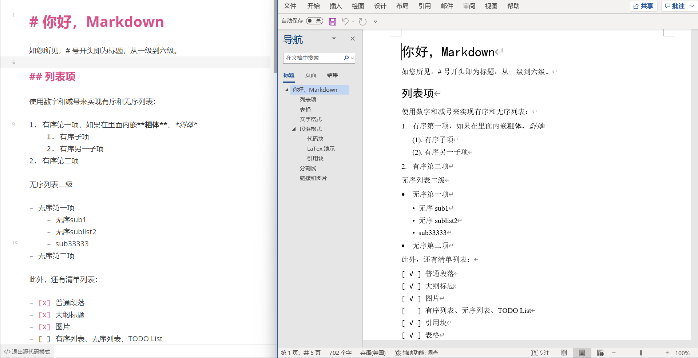

# markdocx

将你的 markdown 文件转换为 MS Word（.docx）/ Convert your Markdown files to MS Word (.docx).

🚧 正在开发中 / Under development

## 效果图



## 使用方法
1. 在 [Release](https://github.com/greyovo/markdocx/releases) 下载可执行文件（暂未提供 macOS 版）
2. 在可执行文件所在目录，终端执行命令：`.\markdocx path/to/your/file.md`，会在 md 文件的同目录下生成同名 docx 文件。

完整命令示例：

```shell script
markdocx input.md -o ouput.docx -s style.yaml -a
```
其中：
 - `-o` 可选参数，其后附上输出路径，默认保存到与 `input.md` 同目录位置、同名的 Word 文件。
 - `-s` 可选参数，其后附上定义样式的 YAML 文件的路径。默认使用内置样式 `src/config/default_style.yaml`。
 - `-a` 可选参数，在完成导出后自动打开 Word 文件

注意，如果是路径中**包含空格**，需要用英文(半角)双引号包起来，如

```shell script
markdocx "D:/my folder/the input.md" -o "D:/my folder/the output.md"
```

## 已知问题 ⁉️ 

1. 行内的样式超过一个的句子会在解析时会被忽略，**不会**出现在最终word文件中。例如此类：
    ```markdown
    **又加粗又*斜体***
    <u>**又加粗又*斜体*又下划线**</u>
    ```
    请避免使用复合标记。
    
2. 代码块中如果有 `#` 或 `*` 等 markdown 行内标记的符号（如 C 语言中的 `#include` 可能被错误识别为一级标题），有可能会被误识别为 markdown 文本而错误渲染，待解决。

2. 无序列表和有序列表目前最大解析层级为两级，超过两层的内容可能会被丢弃


## 自定义样式参数

### 样式名称

| YAML 中的值 | 含义     |
| ----------- | -------- |
| h1          | 一级标题 |
| h2          | 二级标题 |
| h3          | 三级标题 |
| h4          | 四级标题 |
| normal      | 正文     |
|             |          |
|             |          |

### 示例模板

完整 YAML 见 [src/config/default_style.yaml](src/config/default_style.yaml)

```yaml
h1: # 样式名称，可取的值见上表
  font:
    default: Times New Roman # 西文字体，默认 [Times New Roman]
    east-asia: 宋体 # 中文字体，默认 [宋体]
    size: 12 # 字体大小，默认 [12]，单位：pt
    color: "000000" # RGB颜色 16 进制值，必须是字符串，默认 ["000000"] 纯黑色
    extra: # 默认不添加这些样式。支持下列样式，有则生效，无则忽略
    - bold # 加粗
    - italic # 斜体
    - underline # 下划线
    - strike # 删除线
  first-line-indent: 0 # 首行缩进，默认 [0]，单位：倍
  line-spacing: 1.2 # 行距，默认 [1.2] 单位：倍，表示行距设置为 1.2 倍行高，
  space:
    before: 0 # 段前空格，默认 [0] pt
    after: 0 # 段后空格，默认 [0] pt
```


## 从源码构建

1. 需要 Python 3.0+ 环境
2. 安装依赖 `pip install -r requirements.txt`
3. 入口文件 `markdocx.py`
4. 构建可执行文件
   1. Windows 下运行 `build.bat`
   2. macOS 复制 `build.bat` 中的命令到终端执行（待验证）

## 未来计划

- [x] 使用 YAML 导入样式参数
- [ ] 提供 GUI
- [ ] 提供 macOS 版本。需要 macOS 环境，目前我只有 Windows 设备。欢迎参与贡献:)

## 可解析的语法

- [x] 普通段落
- [x] 一到四级标题，保留大纲导航
- [x] 本地图片、网络图片、图片标题
- [x] 有序列表、无序列表、TODO List
- [x] 引用块
- [x] 表格
- [x] 超链接
- [x] 分割线，在 Word 中表现为分页符
- [x] 加粗、斜体、下划线
- [x] 行内代码
- [x] 上标、下标
- [x] 高亮文本
- [ ] 代码块样式优化（或转换为图片）

## 暂时无法实现
- LaTeX
- 脚注

